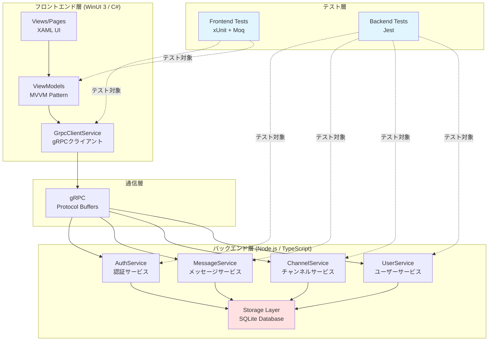
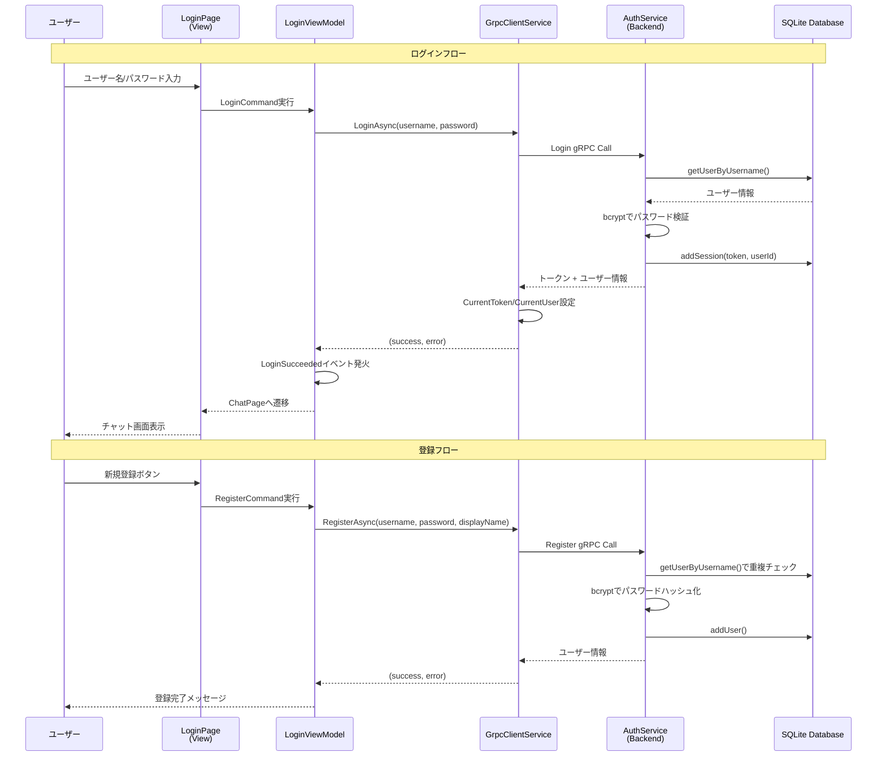
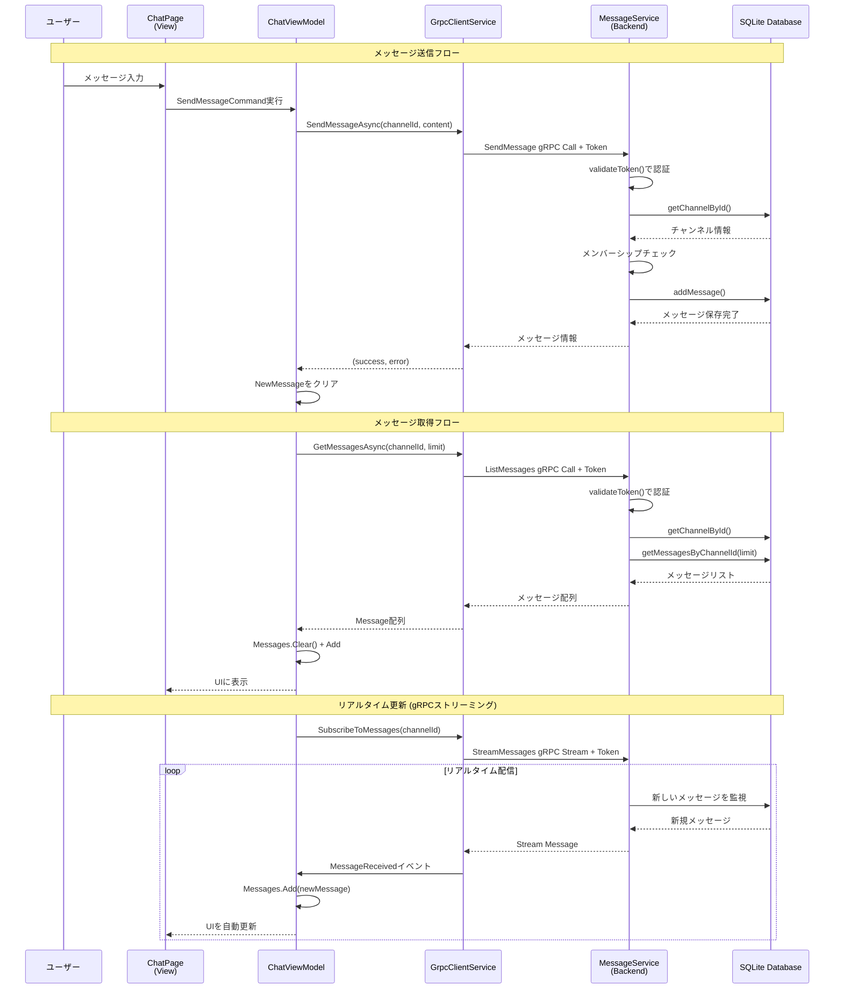
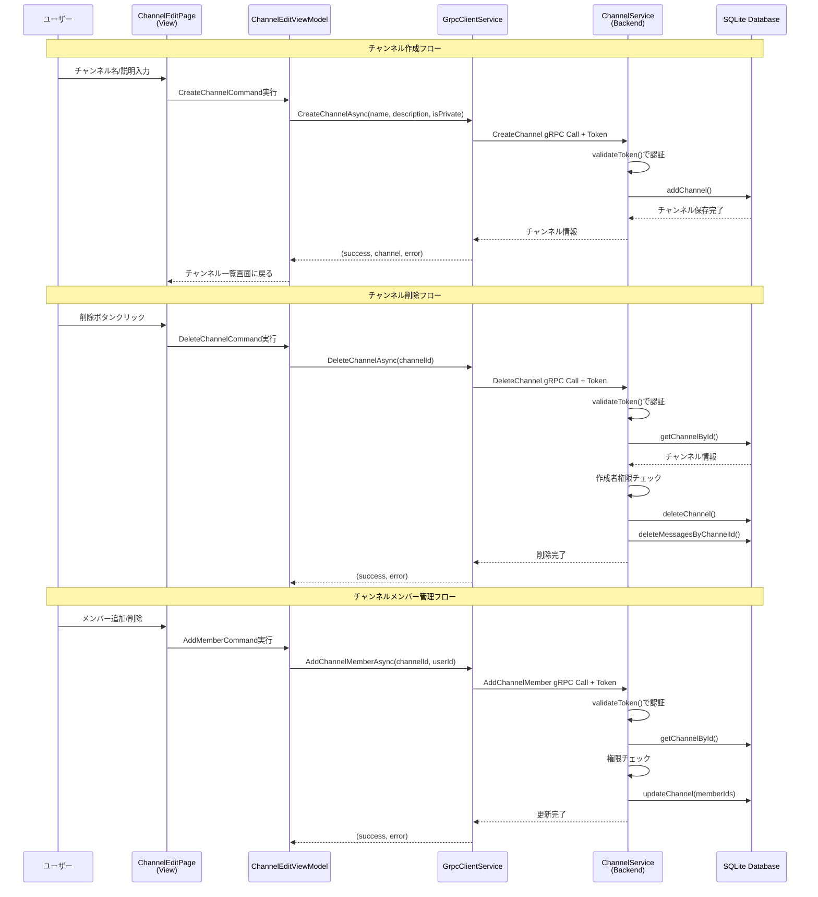
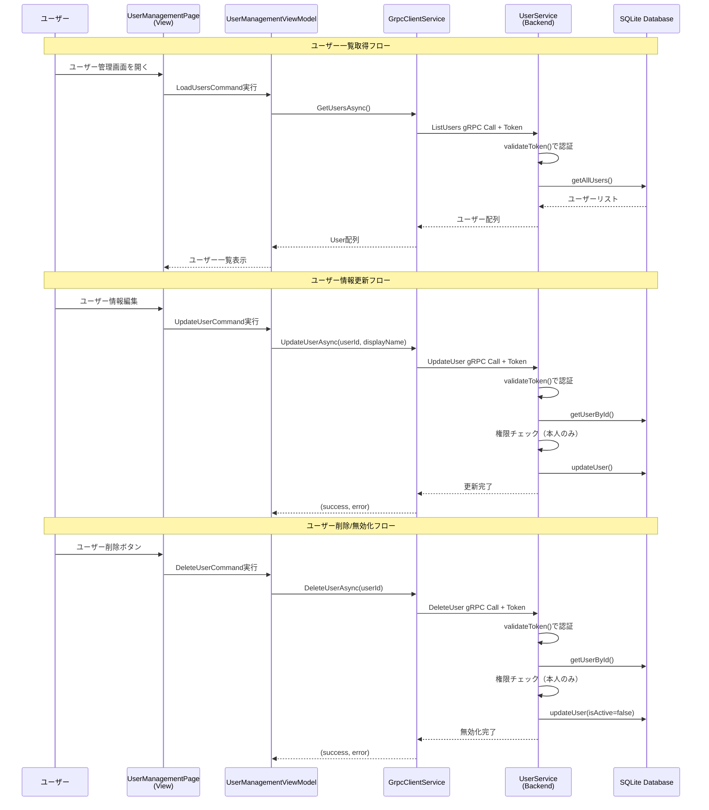
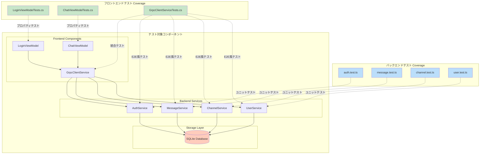

# システムフロー図とテストの相関

このドキュメントでは、WinUI-gRPCチャットアプリケーションのシステムフローと、各フローに対応するテストプログラムの関係を示します。

## 目次

1. [全体アーキテクチャ](#全体アーキテクチャ)
2. [認証フロー](#認証フロー)
3. [メッセージングフロー](#メッセージングフロー)
4. [チャンネル管理フロー](#チャンネル管理フロー)
5. [ユーザー管理フロー](#ユーザー管理フロー)
6. [テストカバレッジマップ](#テストカバレッジマップ)

---

## 全体アーキテクチャ

システムは3層アーキテクチャで構成されています。



**テスト対応:**
- **フロントエンドテスト** (`packages/frontend.tests/`): ViewModels, GrpcClientService
- **バックエンドテスト** (`packages/backend/src/__tests__/`): 各gRPCサービスロジック

---

## 認証フロー

ユーザー認証（ログイン、登録、トークン検証）のフロー図です。



**テスト対応:**

| テストファイル | テスト内容 | 対応コード |
|--------------|----------|----------|
| `frontend.tests/ViewModels/LoginViewModelTests.cs` | プロパティバインディング<br/>入力バリデーション | `LoginViewModel.cs:20-85` |
| `frontend.tests/Services/GrpcClientServiceTests.cs` | ログイン/登録の統合テスト<br/>エラーハンドリング | `GrpcClientService.cs:36-81` |
| `backend/__tests__/auth.test.ts` | ログイン成功/失敗<br/>パスワード検証<br/>トークン生成<br/>ユーザー登録 | `services/auth.ts:23-95` |

**テストケース例:**
- ✅ 正しいユーザー名とパスワードでログイン成功 (`auth.test.ts:23`)
- ❌ 存在しないユーザー名でログイン失敗 (`auth.test.ts:52`)
- ❌ 間違ったパスワードでログイン失敗 (`auth.test.ts:70`)
- ❌ 無効化されたユーザーでログイン失敗 (`auth.test.ts:97`)
- ✅ 新規ユーザー登録成功 (`auth.test.ts:197`)
- ❌ 既存ユーザー名での登録拒否 (`auth.test.ts:218`)

---

## メッセージングフロー

メッセージの送信、取得、リアルタイム更新のフロー図です。



**テスト対応:**

| テストファイル | テスト内容 | 対応コード |
|--------------|----------|----------|
| `frontend.tests/ViewModels/ChatViewModelTests.cs` | メッセージリスト管理<br/>チャンネル選択時の動作<br/>送信ロジック | `ChatViewModel.cs:38-85` |
| `frontend.tests/Services/GrpcClientServiceTests.cs` | 認証なしでのメッセージ送信失敗 | `GrpcClientService.cs:105-116` |
| `backend/__tests__/message.test.ts` | メッセージ送信<br/>メッセージ取得<br/>メッセージ削除<br/>権限チェック | `services/message.ts:44-130` |

**テストケース例:**
- ✅ メッセージ送信成功 (`message.test.ts:45`)
- ❌ 認証エラーで送信失敗 (`message.test.ts:68`)
- ❌ 存在しないチャンネルへの送信失敗 (`message.test.ts:87`)
- ❌ メンバーでない場合は送信拒否 (`message.test.ts:107`)
- ✅ チャンネルのメッセージリスト取得 (`message.test.ts:134`)
- ✅ 自分のメッセージ削除成功 (`message.test.ts:189`)
- ❌ 他人のメッセージは削除不可 (`message.test.ts:219`)

---

## チャンネル管理フロー

チャンネルの作成、更新、削除のフロー図です。



**テスト対応:**

| テストファイル | テスト内容 | 対応コード |
|--------------|----------|----------|
| `frontend.tests/Services/GrpcClientServiceTests.cs` | 認証なしでのチャンネル作成失敗 | `GrpcClientService.cs:120-133` |
| `backend/__tests__/channel.test.ts` | チャンネル作成<br/>チャンネル更新<br/>チャンネル削除<br/>メンバー管理<br/>権限チェック | `services/channel.ts:全体` |

**テストケース例:**
- ✅ チャンネル作成成功
- ✅ プライベートチャンネル作成
- ✅ チャンネル更新（作成者のみ）
- ❌ 作成者以外は更新不可
- ✅ チャンネル削除（作成者のみ）
- ✅ メンバー追加/削除
- ❌ メンバーでないユーザーのアクセス拒否

---

## ユーザー管理フロー

ユーザー情報の取得、更新、削除のフロー図です。



**テスト対応:**

| テストファイル | テスト内容 | 対応コード |
|--------------|----------|----------|
| `frontend.tests/Services/GrpcClientServiceTests.cs` | 認証なしでのユーザー取得 | `GrpcClientService.cs:94-102` |
| `backend/__tests__/user.test.ts` | ユーザー取得<br/>ユーザー更新<br/>ユーザー削除<br/>権限チェック | `services/user.ts:全体` |

**テストケース例:**
- ✅ ユーザー一覧取得
- ✅ ユーザー情報更新（本人のみ）
- ❌ 他人のユーザー情報更新不可
- ✅ ユーザー削除/無効化（本人のみ）
- ❌ 他人のユーザー削除不可

---

## テストカバレッジマップ

システム全体のテストカバレッジを視覚化します。



### テストカバレッジ詳細

| レイヤー | コンポーネント | テストファイル | カバレッジ内容 |
|---------|-------------|-------------|-------------|
| **Frontend ViewModels** | LoginViewModel | `LoginViewModelTests.cs` | ✅ プロパティバインディング<br/>✅ 入力バリデーション<br/>⚠️ コマンド実行（依存性注入が必要） |
| | ChatViewModel | `ChatViewModelTests.cs` | ✅ コレクション初期化<br/>✅ チャンネル選択<br/>⚠️ メッセージ送受信（依存性注入が必要） |
| **Frontend Services** | GrpcClientService | `GrpcClientServiceTests.cs` | ✅ 認証なしでのエラーハンドリング<br/>✅ 各API呼び出しの基本動作<br/>⚠️ 実際のサーバー必要（統合テスト） |
| **Backend Services** | AuthService | `auth.test.ts` | ✅ ログイン成功/失敗<br/>✅ ユーザー登録<br/>✅ トークン検証<br/>✅ パスワードハッシュ化 |
| | MessageService | `message.test.ts` | ✅ メッセージ送信/取得/削除<br/>✅ 認証チェック<br/>✅ 権限チェック |
| | ChannelService | `channel.test.ts` | ✅ チャンネルCRUD<br/>✅ メンバー管理<br/>✅ 権限チェック |
| | UserService | `user.test.ts` | ✅ ユーザーCRUD<br/>✅ 権限チェック<br/>✅ 無効化処理 |

### テスト実行方法

#### フロントエンドテスト

```bash
cd packages/frontend.tests
dotnet test
```

**詳細出力:**
```bash
dotnet test --logger "console;verbosity=detailed"
```

**カバレッジレポート:**
```bash
dotnet test --collect:"XPlat Code Coverage"
```

#### バックエンドテスト

```bash
cd packages/backend
npm test
```

**ウォッチモード:**
```bash
npm run test:watch
```

**カバレッジレポート:**
```bash
npm run test:coverage
```

---

## まとめ

このシステムは以下の特徴を持ちます:

1. **3層アーキテクチャ**: プレゼンテーション層（WinUI 3）、ビジネスロジック層（Node.js gRPCサービス）、データ層（SQLite）
2. **包括的なテストカバレッジ**: フロントエンドとバックエンドの両方でユニットテストを実装
3. **認証とセキュリティ**: トークンベース認証、パスワードハッシュ化、権限チェック
4. **リアルタイム通信**: gRPCストリーミングによるメッセージのリアルタイム配信

### 今後の改善提案

- [ ] フロントエンドViewModelに依存性注入を実装し、完全なユニットテストを可能にする
- [ ] E2Eテストの追加（Playwright、Seleniumなど）
- [ ] パフォーマンステストの追加
- [ ] セキュリティテスト（ペネトレーションテスト、脆弱性スキャン）
- [ ] CI/CDパイプラインでの自動テスト実行
